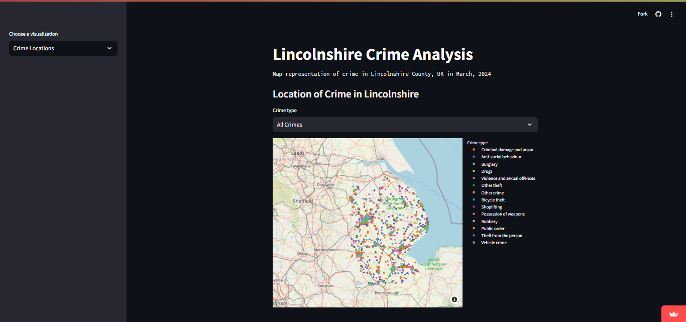

# Lincolnshire Crime Analysis
A data analysis of crime in the Lincolnshire County, England.


<br>

**Here are the technologies I used:**
- Python
- [Streamlit](https://streamlit.io/)
- [Pandas](https://pandas.pydata.org/)
- [Geojson](https://pypi.org/project/geojson/)
- [Plotly](https://plotly.com/)

## Installation
### 1. Prerequisites
Python 3.10+, Git

### 2. Clone Project
Open a terminal and run the following commands:
```bash
git clone https://github.com/emmaduru/linconshire-crime-analysis.git
cd linconshire-crime-analysis
```

### 3. Create virtual environment and install dependencies from pyproject.toml
```bash
poetry install
```


### 4. Running the web application
Launch the development server:

```bash
python main.py
```

Go to http://localhost:8501 in a web browser
